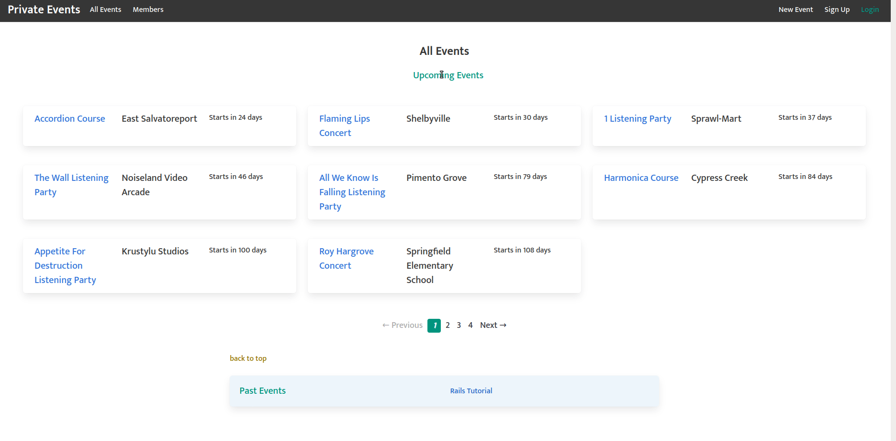

# Private Events 

This is the repository for a Rails app similar to Eventbrite. It is a project in Active Record Associations as part of The Odin Project [curriculum](https://www.theodinproject.com/paths/full-stack-ruby-on-rails/courses/ruby-on-rails/lessons/associations). Users can register, login, create events, invite other users to events, and rsvp to invitations. Events and invitations can be created, read, updated, or destroyed.

## Demo

*Event and Invitation flow*

***

### Installation

1. Install Locally.
    - Clone this repo.
    - cd into cloned directory `cd private-events`
    - `bundle install && yarn install`

2. Seed the database.
    - `rails db:migrate`
    - `rails db:seed`

3. Start a Rails Server.
    - `rails server`
    - Navigate to `localhost:3000` in your browser.
4. Play around with the app.
    - To get started, click "login" in upper right navbar.
    - Login with placeholder credentials (works on Heroku site too!).
    - See which events you've been invited to!

### Running the Tests

#### To run all the tests

- `rspec spec/` from the `private-events` directory.

#### To run specific spec categories

- `rspec spec/features`
- `rspec spec/models`
- `rspec spec/requests`

### Authentication and Login

- uses `bcrypt` and `has_secure_password` for authentication
- Note: I decided not to use Devise for authentication for at least one project. I wanted some experience building my own basic authentication system.

### Active Record Associations

- many to many relationships
- `has_many, through:` relationships
- generate db migrations with proper foreign keys

### Active Record Queries

- use `scope` to limit records returned to a specific constraint
- use `includes` method to eager load records where appropriate
- use `joins` to join two tables together when necessary

#### Notable Gems used

- bcrypt
- bullet
- will_paginate
- guard
- guard-rspec
- shoulda-matchers
- factory_bot_rails
- faker
- simplecov
