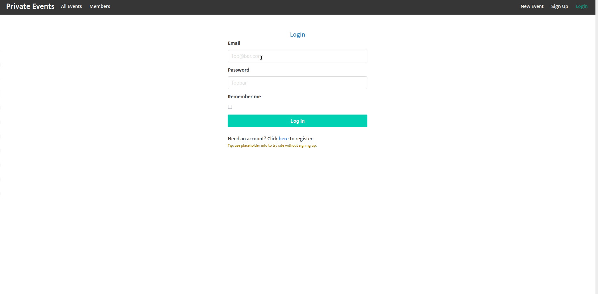

# Private Events 

This is the repository for a Rails app similar to Eventbrite. It is a project in Active Record Associations as part of The Odin Project [curriculum](https://www.theodinproject.com/paths/full-stack-ruby-on-rails/courses/ruby-on-rails/lessons/associations). Users can register, login, create events, invite other users to events, and rsvp to invitations. Events and invitations can be created, read, updated, or destroyed. Mailers are also setup to send emails in production.

## Demo

*Event and Invitation flow*

***

### Features

  - Sign-up/Login/Logout/Delete Account.
  - Receive email upon signing up, when invited/uninvited to an event, and when an event is canceled.
  - Create/Read/Update/Delete Events.
  - Create/Read/Update/Delete Invitations.
  - Invite one or multiple guests at one time.
  - "Attend" or "Leave" Events.
  - Limit certain features to logged-in users (RSVPing to events, creating an event, seeing who's been invited to an event, etc.)
  - ActionCable: Message Channel (live message other logged in users) and Appearance Channel (see who's online using the website).

### Installation

1. Install Locally.
    - Clone this repo.
    - cd into cloned directory `cd private-events`
    - `bundle install && yarn install`

2. Seed the database.
    - `rails db:migrate`
    - `rails db:seed`

3. Start a Rails Server.
    - `rails server`
    - Navigate to `localhost:3000` in your browser.
    
4. Play around with the app.
    - To get started, click "login" in upper right navbar.
    - Login with placeholder credentials (works on Heroku site too!).
    - See which events Foo Bar has been invited to.
    - OR Signup and receive a welcome email.
    - Log back in as Foo Bar.
    - Invite the account you just used to sign up
    - Message other members on the Members page or an event's page. (Event messages are unique to their respective events.)
    - See who's using the site on the Members page.
    - Receive an invitation email.

### Running the Tests

#### To run all the tests

- `bundle exec rspec spec/` from the `private-events` directory.

#### To run specific spec categories

- `bundle exec rspec spec/features`
- `bundle exec rspec spec/models`
- `bundle exec rspec spec/requests`

### Authentication and Login

- uses `bcrypt` and `has_secure_password` for authentication
- Note: I decided not to use Devise for authentication for at least one project. I wanted some experience building my own basic authentication system.

### Active Record Associations

- many to many relationships
- `has_many, through:` relationships
- generate db migrations with proper foreign keys

### Active Record Queries

- use `scope` to limit records returned to a specific constraint
- use `includes` method to eager load records where appropriate
- use `joins` to join two tables together when necessary

### Action Cable Features

- facilitate messaging between users in real time with WebSocket connection
- optionally associate a message with an event
- ensure live messages are only shown on their respective event page by utilizing dynamic ids selected with JS.

#### Notable Gems used

- bcrypt
- bullet
- will_paginate
- guard
- guard-rspec
- shoulda-matchers
- factory_bot_rails
- faker
- simplecov
